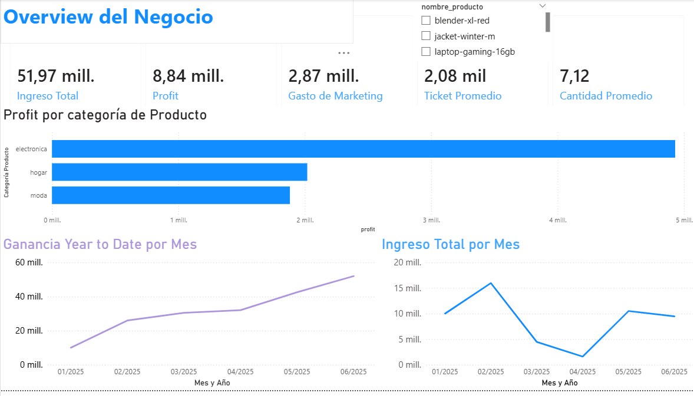
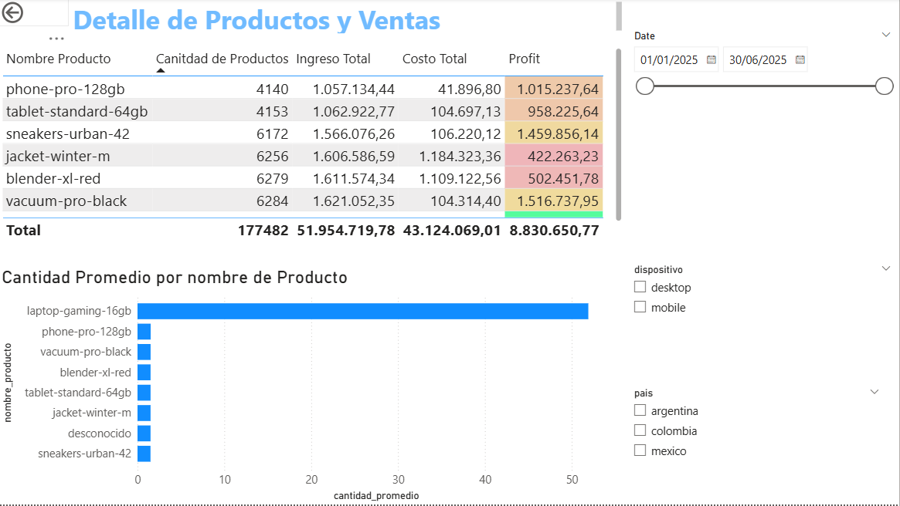

# 📊 RappiPlus — Business Analytics - Dashboard

**End-to-End Data Analytics Project | Python · SQL · Power BI**

Analysis of RappiPlus business performance using transactional, marketing, user behavior, and experimental data to transform raw information into **actionable business insights**.

---

## 🛠️ Skills & Technologies

`Python` · `Pandas` · `NumPy` · `SQL` · `PostgreSQL` · `Power BI` · `DAX` · `A/B Testing` · `GitHub`

---

## 🎯 Objective

Evaluate the performance of RappiPlus and identify opportunities for business improvement by analyzing:

* 💰 Revenue, costs and profitability
* 🛒 Customer conversion funnel
* 🔁 User retention
* 🧪 Checkout A/B experiment
* 📊 Business KPIs and trends

---

## 👨‍💻 My Role

Developed the complete analytics workflow from **raw data to business insights and visualization**:

* Cleaned and validated multiple datasets using **Python & Pandas**
* Calculated revenue, costs, profit and key business KPIs
* Built **conversion funnel and cohort retention analyses using SQL**
* Evaluated a checkout redesign through **statistical A/B testing**
* Developed an interactive **Power BI dashboard**

---

## 🚀 Results & Impact

The analysis identified:

* **$9.62M** in total revenue
* **$2.92M** in net profit
* **$385.88** average order value
* Key customer drop-off points throughout the conversion funnel
* User retention patterns through cohort analysis
* No statistically significant improvement from the proposed checkout redesign (`p = 0.416`)

The final solution consolidates these findings into an interactive dashboard designed to support **data-driven business decisions**.

---

# 📊 Final Dashboard

### Executive Overview

### Product & Order Detail

---

## 📁 Project Files

* 📓 **Jupyter Notebook** — Complete Python, SQL and statistical analysis
* 📊 **Power BI Dashboard** — Interactive business dashboard
* 📁 **Processed Data** — Clean datasets used for visualization

---

### 👤 Diego Pastrana

**Mechatronics Engineer | Data Analytics & Artificial Intelligence**

`Python` · `SQL` · `Power BI` · `Machine Learning` · `Data Analysis`
